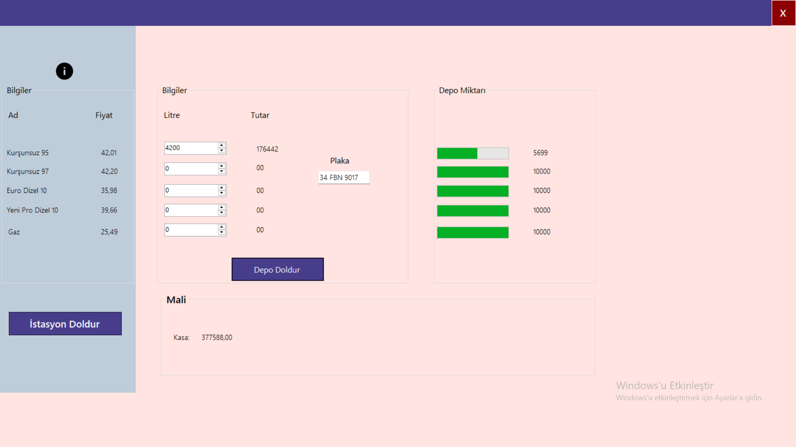
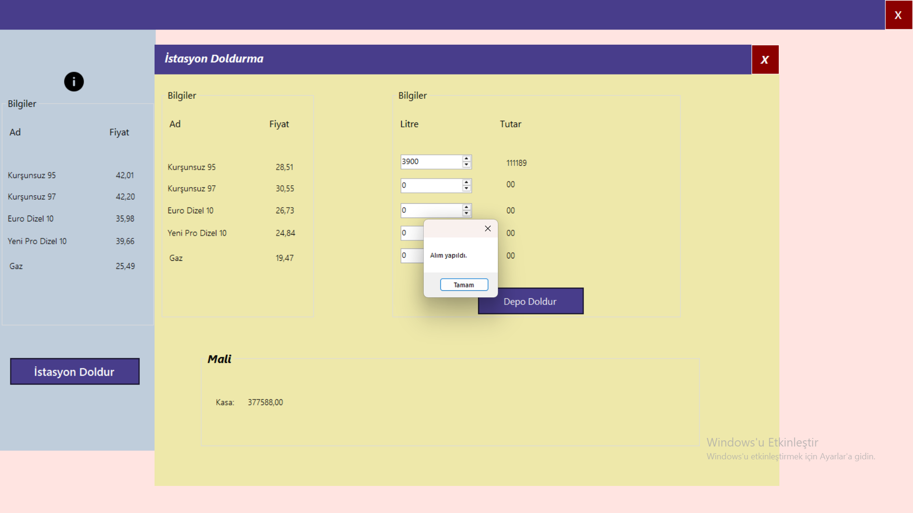

# Akaryakit-Istasyonu
# Akaryakıt Otomasyon

Bu proje Murat Yücedağ'ın Udemy'deki eğitim videosundaki projedir. Araca benzin alma, bunların kayıdını tutma ve gerektiğinde istasyon deposunu doldurmaya yarayan otomasyon sistemidir. Alış ve satış fiyaatları veritabanı yardımıyla işlenmektedir. Ayrıca istasyondaki kasa değerini TL cinsinden gösteren modül de eklenmiştir.

## Görüntüler

